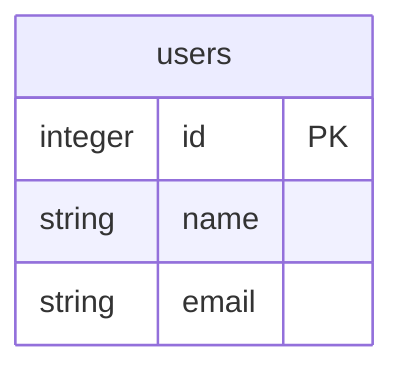
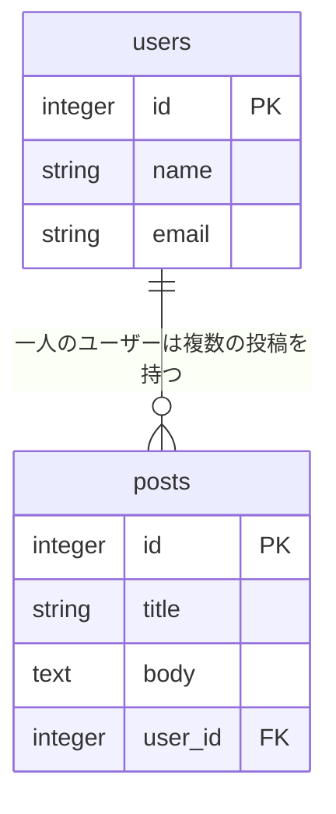
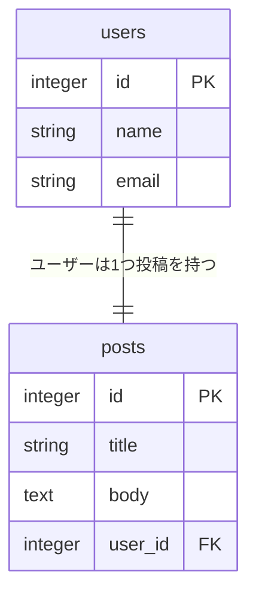
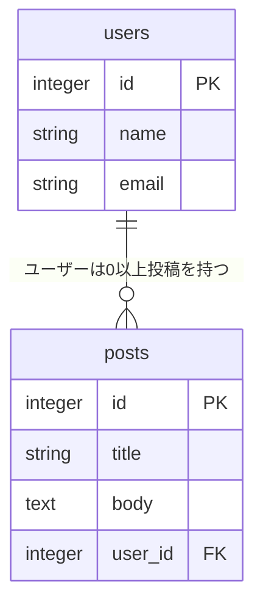
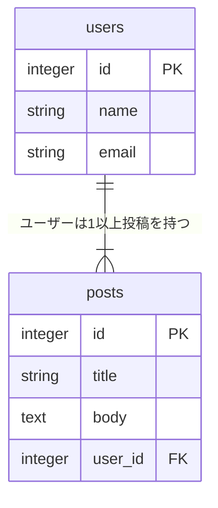

## mermaidの使用方法

マークダウンファイルにmermaid記法を指定してコードブロックを作成するとGithubのコメントやプレビューでER図が表示される。
`erDiagram`と記述しER図を指定。
下記のように記述するとテーブルができる。

```
erDiagram

users{
integer id PK
string name
string email
}
```


## リレーションの定義
1:nのリレーションは下記のように記述する。
```ruby
users ||--o{ posts:"一人のユーザーは複数の投稿を持つ"
#リレーションシップに関係性の記述が不要なときは""のなかを書かなくていい
```

## カーディナリィごとの記述方法
#### 0または1
```
users ||--o|posts:"ユーザーは０か１つ投稿を持つ"
```


#### 1
```
users ||--||posts:"ユーザーは1つ投稿を持つ"
```


#### 0以上
```
users ||--o{posts:"ユーザーは0以上投稿を持つ"
```


#### 1以上
```
users ||--|{posts:"ユーザーは1以上投稿を持つ"
```


